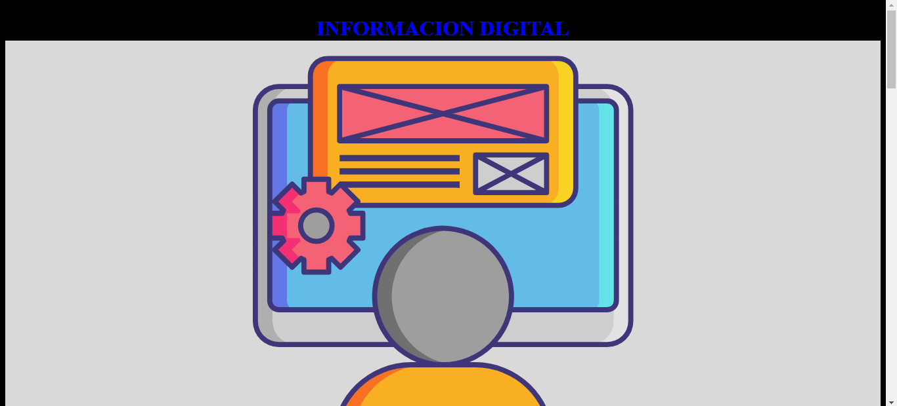
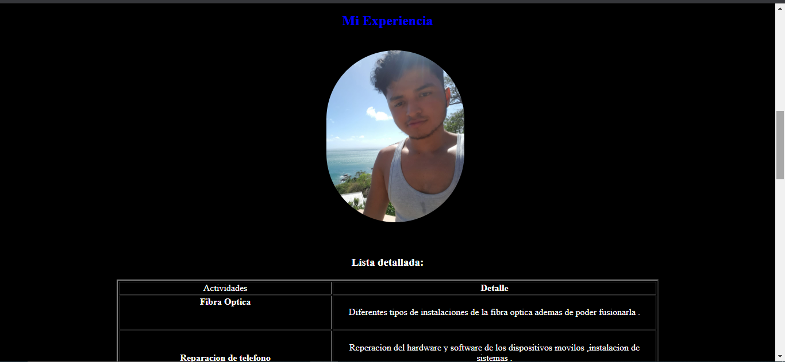
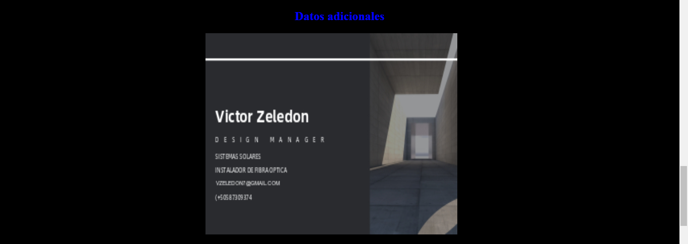
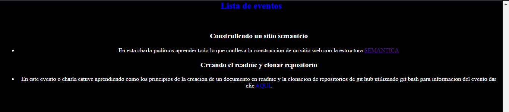
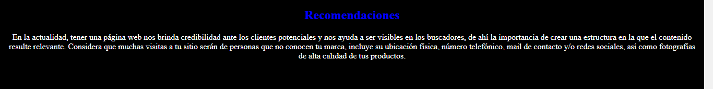

# INFORMACION SOBRE MI

En este documento estare dando informacion sobre el resultado de mi sitio web.

## Cabecera 

Como podemos ver este es el principio de mi pagina web.

## Mi experiencia 

Como podemos ver a continuacion aqui muestro mi experiencia profesional y los cursos en los cuales yo he participado .

## Datos adicionales y lista de eventos 

En este otro apartado puedo ver datos adicionales de mis experiencias y contacto sobre mi , a la cual tambien muestro algunos eventos a los cuales yo he asistido .

## Recomendaciones

Aqui hablo un poco sobre la importancia de las paginas web y ademas sobre que debemos expresar nuestro pensar , y compartir sobre nuestras experiencias en las creaciones de las paginas web.

## Pie de pagina 

Visualizacion de nuestro pie la pagina web.

## Conclusión

He tenido muy bonita experiencia con la creación de este pequeño proyecto web , he aprendido de que debemos compartir el concomiento de manera libre y sin temor con las demas personas porque todos aprendemos de todos .